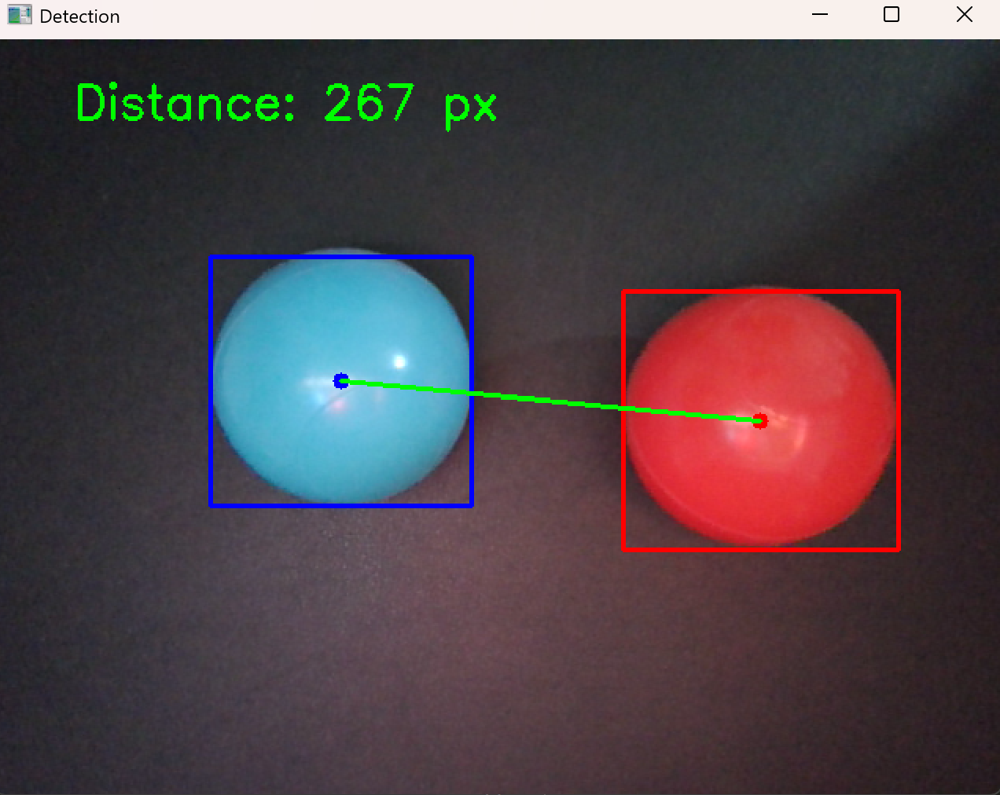

# Color Object Distance Tracker

This computer-vision project tracks one blue object and one red object in a live webcam feed, then measures the distance between their centre points in pixels.




## What makes this project useful

The project combines colour segmentation, contour detection, and geometric measurement in a small real-time application. It is a practical starting point for robotics tasks that need to identify coloured markers, estimate their relative position, or trigger an action when objects move closer together.

## Features

- Real-time webcam processing
- HSV-based detection of blue and red objects
- Bounding boxes and centre-point markers
- Live centre-to-centre distance measurement in pixels
- An HSV trackbar tool for tuning colour thresholds under different lighting

## Technical approach

1. **Convert BGR to HSV.** HSV separates hue from brightness and saturation, making colour thresholding more stable than using BGR values directly.
2. **Build colour masks.** `cv2.inRange()` creates a binary mask for each target colour. Red needs two hue ranges because the red hue crosses the start/end of OpenCV's HSV hue scale (0-179).
3. **Find the main object.** The program detects contours in each mask and uses the largest contour, reducing the effect of small noisy regions.
4. **Calculate centres.** A bounding rectangle is drawn around each object. The centre is calculated from its rectangle as `(x + w/2, y + h/2)`.
5. **Measure distance.** When both objects are detected, their centre points are connected and the Euclidean distance is displayed:

```text
distance_px = sqrt((blue_x - red_x)^2 + (blue_y - red_y)^2)
```

The result is a screen-space distance in pixels. To measure centimetres or metres, the camera must be calibrated and the scene needs a known reference scale or depth information.

## Requirements

- Python 3
- A webcam
- OpenCV
- NumPy

Install dependencies:

```bash
pip install opencv-python numpy
```

## Run

```bash
python color_object_distance_tracker.py
```

Put one blue object and one red object in front of the camera. Press `Esc` to close the detection window.

## Files

| File | Purpose |
| --- | --- |
| `color_object_distance_tracker.py` | The main application: detects objects and measures their distance. |
| `hsv_color_tuner.py` | Interactive HSV sliders for finding reliable threshold values. |


## Limitations and tuning

- Detection can be affected by lighting, reflections, shadows, and similarly coloured backgrounds.
- Only the largest detected contour for each colour is used.
- Run `hsv_color_tuner.py` to tune hue, saturation, and value limits for your objects and environment.

## Contributors

Created by **Fatima Alfurais**, under the supervision and support of the **RobotiLAB community**.
